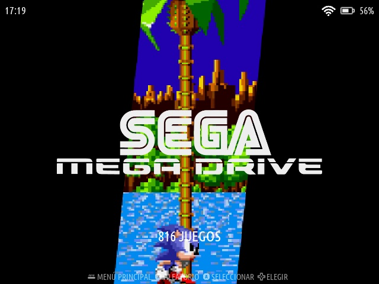
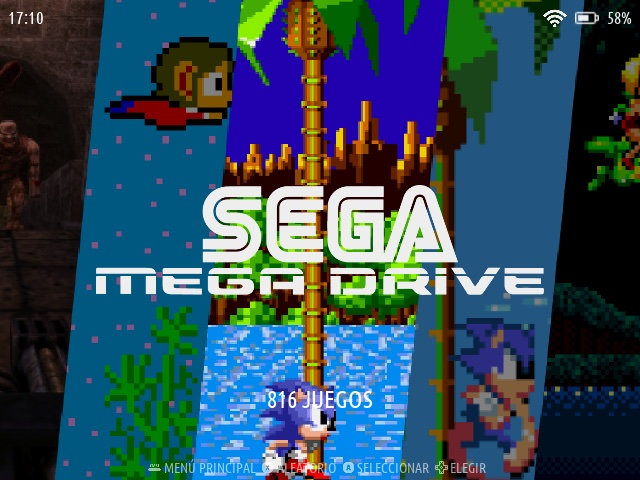

# Art Book Next for RG ARC S Stock Firmware (V12)

Based on the original Theme [Art Book Next by anthonycaccese](https://github.com/anthonycaccese/art-book-next-es) and its variant for [JelOS by nkahoang](https://github.com/nkahoang/es-theme-art-book-next-arkos).

This is a simplified port for the Stock Firmware of the RG ARC S (V12), making the required changes to make it work and show properly all sections.

In order to have a proper display of the Theme, you will have to disable grouping in Retroarch and selected Emulators.

## Preview
|  |  |
| -- | -- |
|  |  |

## Instructions

To install this:
- Go to https://github.com/raycoarana/es-theme-art-book-next-rgarc-stock, click on Code -> Download ZIP
- Extract that zip out, there is a folder named `es-theme-art-book-next-rgarc-stock`.
- Either via direct copy to the games sdcard, SSH or Samba, copy `es-theme-art-book-next-rgarc-stock` to `anbernic/themes/`. SSH recommended as we need the it for the next step.
- Disable Retroarch, Emulators and Apps groups by editing the /userdata/system/configs/emulationstation/es_settings.cfg. You can do this by either Samba or SSH and edit the config bools for Apps, Emulators and Retroarch to `true`.
- Restart EmulationStation by running `/etc/init.d/S31emulationstation restart`.
- Enable the theme via EmulationStation settings (Start button) > UI Settings > `es-theme-art-book-next-rgarc-stock`
- Persist the changes to your es_systems.xml executing `anbernic-save-overlay`.

To connect via SSH, the default user is `root` and its password is `anbernic`.

## Note for theme developers

- You can use rsync to sync changes done in your PC to the device while developing executing something like:

```bash
rsync --progress --exclude='.*' -avhe ssh --delete ./ root@[IPADDRESS]:/userdata/themes/es-theme-art-book-next-rgarc-stock; ssh root@[IPADDRESS] -f "/etc/init.d/S31emulationstation restart"
```
If you just want to just restart EmulationStation remotely:
```bash
ssh root@[IPADDRESS] -f "/etc/init.d/S31emulationstation restart"
```

### **Acknowledgments**
* Most system logos were sourced and modified from the excellent work done by Dan Patrick [here](https://archive.org/details/console-logos-professionally-redrawn-plus-official-versions).  I modified each to be compatible with EmulationStation's current SVG support.
* ChangaOne font is by [Eduardo Tunni](https://www.fontsquirrel.com/fonts/changa)
* Oxygen font is by [Vernon Adams](https://www.fontsquirrel.com/fonts/oxygen)
* Auto-Collection Genre background art created by [@nautipuss](https://github.com/nautipuss)

## **License**
(Attribution back to the OG repo by `anthonycaccese`: https://github.com/anthonycaccese/art-book-next-es)
(Attribution back to the variation for ArkOS by `nkahoang`: https://github.com/nkahoang/es-theme-art-book-next-arkos)
Creative Commons CC-BY-NC-SA - https://creativecommons.org/licenses/by-nc-sa/2.0/
You are free to share and adapt this theme as long as you provide attribution back to me (and the above credits) as well share any updates you make under the same licence terms.
